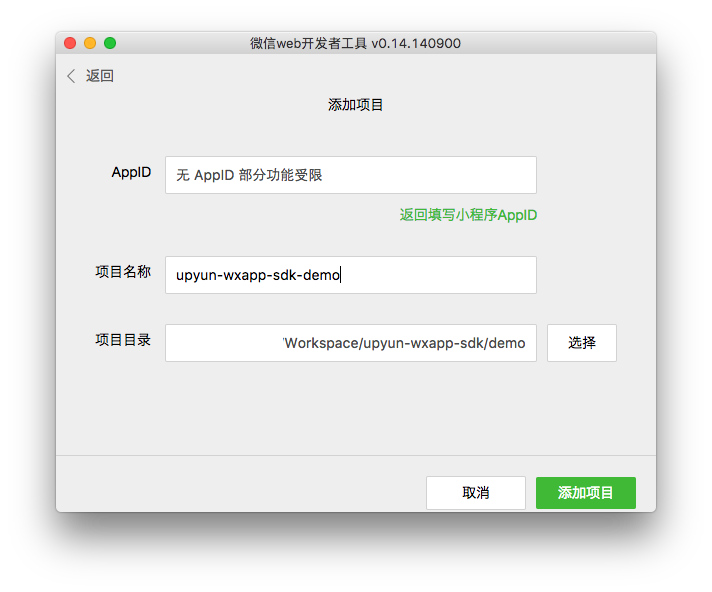

# 又拍云微信小程序 SDK

## 使用

使用方式可以参考 demo

1. 软链 upyun-wxapp-sdk.js 到微信小程序项目
2. 通过 `require` 引入 `Upyun` 类，并初始化一个实例
3. 调用 `upyun.upload` 方法上传文件


## 运行 Demo

下载微信[小程序开发工具](https://mp.weixin.qq.com/debug/wxadoc/dev/devtools/devtools.html)

增加 demo 目录为新项目



运行服务器进程

    npm run demo

## 接口

`Upyun`

* bucket: 空间名
* operator: 操作员
* getSignatureUrl: 计算 `signature` 的服务器接口地址

示例

```js
const upyun = new Upyun({
  bucket: 'sdkimg',
  operator: 'tester',
  getSignatureUrl: 'http://localhost:8080',
})
```

`Upyun.prototype.upload`

* remotePath 在又拍云存储的文件路径
* localPath 本地文件路径
* success 接口调用成功的回调函数
* fail 接口调用失败的回调函数
* complete 接口调用结束的回调函数（调用成功、失败都会执行）

```js
upyun.upload({
  localPath: imageSrc,
  remotePath: '/wxapp/demo',
  success: function(res) {
  },
  fail: function({errMsg}) {
  },
})
```

## 服务器接口

使用又拍云微信小程序 SDK 需要实现一个在服务器进行签名的接口，并将该接口地址作为 `getSignatureUrl` 传入构造函数，

该接口接受 `GET` 请求，并接受一个参数 `data`，计算并返回带有 `signature` 字段的响应

`signature` 的计算公式是

    Base64 (HMAC-SHA1 (<md5_password>, <data>)

其中，`md5_password` 是操作员密码的 MD5 值

## 相关链接

* [微信小程序 uploadFile 接口](https://mp.weixin.qq.com/debug/wxadoc/dev/api/network-file.html#wxuploadfileobject)
* [又拍云表单 API](https://docs.upyun.com/api/form_api/)
* [又拍云表单提交签名算法](http://docs.upyun.com/api/authorization/#body)
